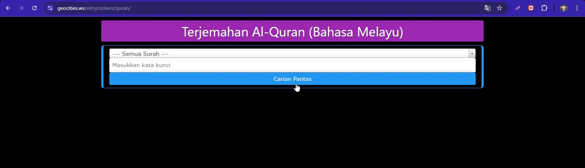
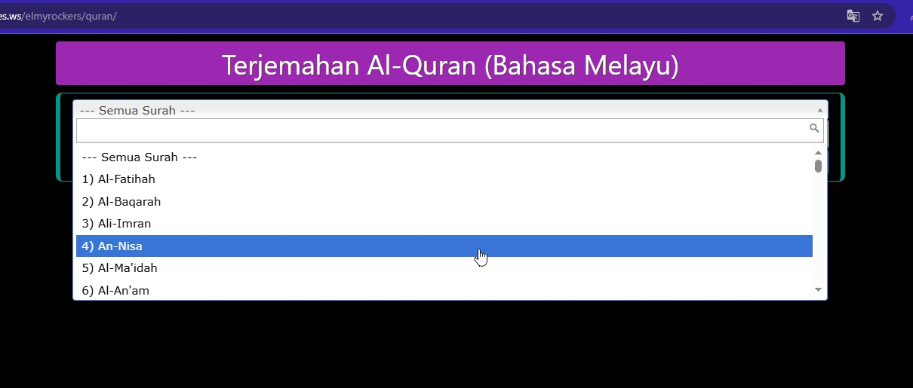
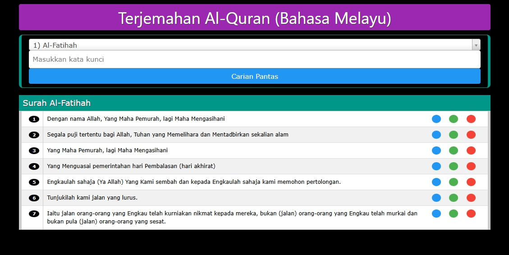
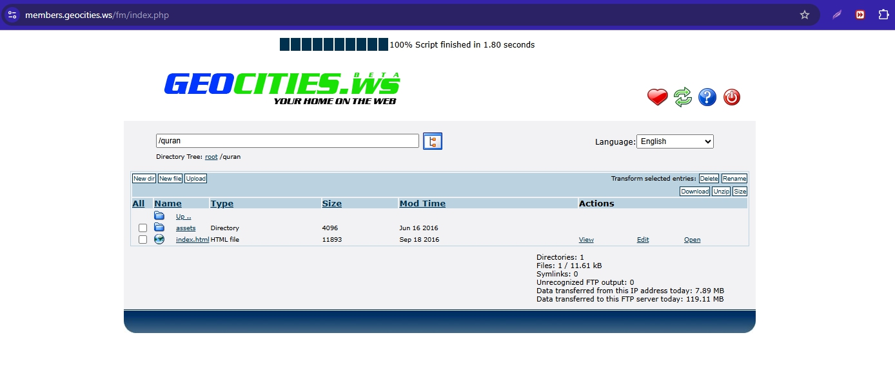
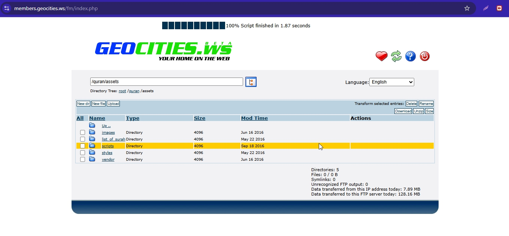

# quran-malay-translation-jquery
I created this Malay Quran translation site in 2016 using jQuery, W3.CSS, and JSON — preserved here as a snapshot from jQuery’s popularity era.

## Screenshots
Here are a few screenshots of the project:

### Screenshot 1

### Screenshot 2

### Screenshot 3

### Screenshot 4

### Screenshot 5
